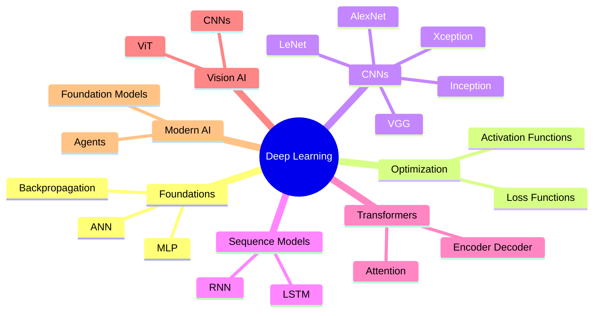
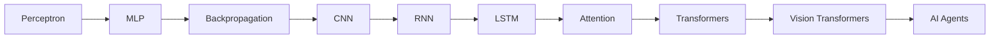

<div align="center">

# 🧠 Deep Learning

### 🚀 MS Artificial Intelligence • FAST-NUCES Islamabad

<p align="center">


</p>

<br>

## ⚡ From Neurons to Intelligent Agents

### Exploring the Foundations Behind Modern Artificial Intelligence

---

*"Deep Learning is the engine powering today's AI revolution."*

</div>

---

# 🌌 Overview

This repository contains lecture notes, research papers, tutorials, activities, and learning resources from the **Deep Learning** course offered in the **MS Artificial Intelligence** program at **FAST-NUCES Islamabad**.

The course explores the complete deep learning landscape, covering:

```text
Artificial Neural Networks
          ↓
Backpropagation
          ↓
Deep Architectures
          ↓
Convolutional Networks
          ↓
Recurrent Networks
          ↓
Transformers
          ↓
Vision Transformers
          ↓
AI Agents
```

---

# 🗺️ Deep Learning Roadmap



---

# 📚 Repository Contents

## 🌱 Foundations of Deep Learning

```text
DL Lect 0 RoadMap
DL Lect 01 Introduction, Learning Paradigms
01 Deep Learning by Nature (2015)
01 Deep Learning by Ian Goodfellow
```

### Topics

* Learning Paradigms
* AI Evolution
* Deep Learning Foundations
* Research Milestones

---

## 🔗 Artificial Neural Networks

```text
DL Lect 2 Artificial Neural Network (ANN)
Lecture # 2-2 MLP
Lecture # 3-1 MLP
DL 03A MLP Computation
```

### Topics

* Perceptrons
* Feedforward Networks
* Multi-Layer Perceptrons
* Neural Computation

---

## ⚙️ Computational Graphs & Backpropagation

```text
04 Computational Graph
Activity 2 Backpropagation
```

### Topics

* Computational Graphs
* Gradient Descent
* Chain Rule
* Backpropagation

---

## 📈 Activation & Loss Functions

```text
DL 04 Activation
Lecture # 3-2 Activation + Loss Functions
```

### Topics

* Sigmoid
* Tanh
* ReLU
* Softmax
* Cross Entropy
* Optimization Objectives

---

## 👁️ Convolutional Neural Networks

```text
Convolutional Neural Networks Part I
Convolutional Neural Networks Part II
DL 05 CNN
DL 05A CNN Tutorial
DL 06 Architecture CNN
CNN Architectures
```

### Topics

* Feature Extraction
* Convolution Operations
* Pooling
* CNN Design Principles

---

## 🏛️ CNN Architectures

```text
LeNet
AlexNet
VGG
Inception
Xception
Transfer Learning
```

### Topics

* Historic Architectures
* Modern CNN Designs
* Transfer Learning
* Computer Vision Applications

---

## 🔄 Sequence Models

```text
DL 07 NLP RNN LSTM
```

### Topics

* Recurrent Neural Networks
* Long Short-Term Memory (LSTM)
* Sequential Data Modeling

---

## 🤖 Transformers

```text
DL 08 Transformers
Lecture # 10-1,2 Transformers Example
```

### Topics

* Self Attention
* Multi-Head Attention
* Encoder-Decoder Architecture
* Foundation Models

---

## 👁️‍🗨️ Vision Transformers

```text
DL 09 VIT
Lecture # 10 Vision Transformers
```

### Topics

* Image Patching
* Visual Attention
* Transformer-Based Vision Models

---

## 🚀 Modern AI Systems

```text
DL 10 Modern AI Systems and Intelligent Agents
```

### Topics

* AI Agents
* Autonomous Systems
* Foundation Models
* Future of AI

---

# 📊 Evolution of Deep Learning



---

# 🛠️ Technology Ecosystem

<div align="center">

| Category             | Technologies     |
| -------------------- | ---------------- |
| Programming          | Python           |
| Scientific Computing | NumPy            |
| Data Analysis        | Pandas           |
| Machine Learning     | Scikit-Learn     |
| Deep Learning        | TensorFlow       |
| Deep Learning        | PyTorch          |
| Experimentation      | Jupyter Notebook |
| Development          | VS Code          |

</div>

---

# 🎯 Skills Developed

<table>
<tr>

<td width="50%">

### 🧠 Neural Networks

* ANN
* MLP
* Backpropagation
* Optimization

</td>

<td width="50%">

### 👁️ Computer Vision

* CNNs
* Transfer Learning
* Vision Transformers
* Image Understanding

</td>

</tr>

<tr>

<td width="50%">

### 🔄 Sequential Learning

* RNNs
* LSTMs
* Sequence Modeling

</td>

<td width="50%">

### 🤖 Modern AI

* Transformers
* Foundation Models
* Intelligent Agents
* Future AI Systems

</td>

</tr>
</table>

---

# 🔬 Research Areas

```text
Deep Learning
│
├── Neural Networks
├── Optimization
├── Computer Vision
├── Sequence Modeling
├── Attention Mechanisms
├── Transformers
├── Vision Transformers
├── Foundation Models
└── AI Agents
```

---

# 📈 Modern AI Stack

```text
Data
 ↓
Neural Networks
 ↓
Deep Learning
 ↓
Transformers
 ↓
Foundation Models
 ↓
Multimodal AI
 ↓
AI Agents
```

---

# 🎓 Academic Information

```yaml
Course: Deep Learning
Program: MS Artificial Intelligence
University: FAST-NUCES Islamabad
Semester: 2
Credit Hours: 3

Core Areas:
  - Neural Networks
  - CNNs
  - RNNs
  - Transformers
  - Vision Transformers
  - AI Agents
```

---

<div align="center">

# 🌟 Building the Intelligence Behind Modern AI

### Neural Networks • Computer Vision • Transformers • Intelligent Agents

<br>

*"From perceptrons to foundation models, deep learning continues to redefine the limits of machine intelligence."*

⭐ Graduate-level exploration of modern deep learning architectures and AI systems.

</div>
