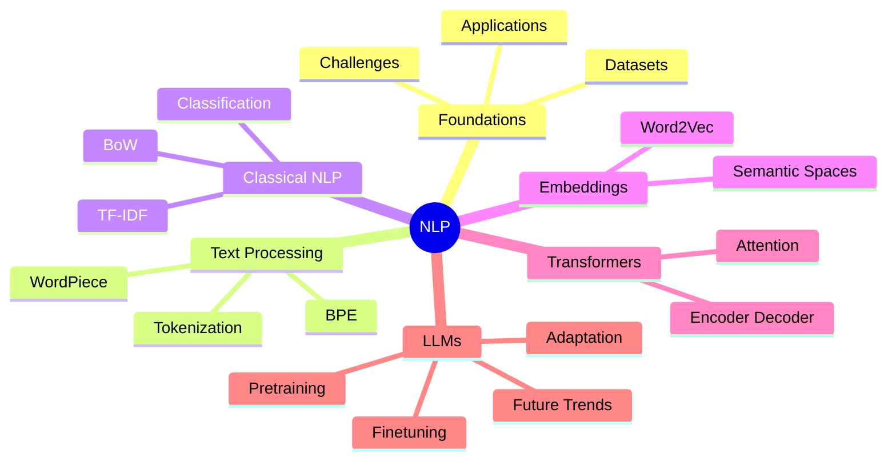
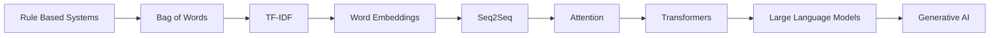

<div align="center">

# 💬 Natural Language Processing

### 🧠 MS Artificial Intelligence • FAST-NUCES Islamabad

<p align="center">


</p>

<br>

### 🚀 From Tokens to Transformers

### Exploring the Science Behind Large Language Models

---

*"Language is humanity's most powerful interface. NLP teaches machines to understand it."*

</div>

<br>

# ✨ About This Repository

This repository documents my learning journey through **Natural Language Processing (NLP)** as part of the **MS Artificial Intelligence** program at **FAST-NUCES Islamabad**.

The course spans the complete NLP ecosystem:

```text
Text Processing
      ↓
Feature Engineering
      ↓
Embeddings
      ↓
Transformers
      ↓
Large Language Models
      ↓
Generative AI
```

---

# 🗺️ Learning Roadmap



---

# 📚 Course Modules

## 🌱 Foundations

```text
NLP 00 RoadMap
NLP 01 Intro, Applications, Datasets, Challenges
```

Understanding:

* What NLP is
* Real-world applications
* Common datasets
* Research challenges

---

## 🔤 Text Processing & Tokenization

```text
NLP 02A Preparing Text for Language Models
NLP 02B BPE Word Piece Tutorial
NLP 02D Lab Text for Language Models
NLP BPE Activity
```

Topics:

* Text normalization
* Tokenization
* Byte Pair Encoding (BPE)
* WordPiece Algorithms
* Data preprocessing pipelines

---

## 📊 Classical NLP

```text
NLP 03 Classical Text Features & Classification
NLP 03A TF-IDF Tutorial
```

Topics:

* Bag of Words
* TF-IDF
* Text Classification
* Feature Engineering

---

## 🌌 Vector Semantics

```text
NLP 4 Vector Semantics & Embeddings
```

Topics:

* Word Embeddings
* Semantic Similarity
* Vector Spaces
* Representation Learning

---

## 🤖 Transformers & LLMs

```text
DL 08 Transformers
NLP 5 Large Language Models
NLP 6 LLM Decoding and Pretraining
NLP 7 LLM Finetune
NLP 8 LLM Adaptation & Future Trends
```

Topics:

* Self-Attention
* Transformers
* GPT-style Models
* LLM Pretraining
* Fine-Tuning
* PEFT Techniques
* Future of NLP

---

# 🧠 NLP Technology Stack

<div align="center">

| 🛠 Tool      | Purpose             |
| ------------ | ------------------- |
| Python       | Core Development    |
| NumPy        | Numerical Computing |
| Pandas       | Data Processing     |
| Scikit-Learn | Classical ML        |
| NLTK         | NLP Fundamentals    |
| SpaCy        | Industrial NLP      |
| PyTorch      | Deep Learning       |
| Hugging Face | Transformers & LLMs |

</div>

---

# 📈 Evolution of NLP



---

# 🎯 Skills Acquired

<table>
<tr>
<td width="50%">

### Classical NLP

* Text Cleaning
* Feature Engineering
* TF-IDF
* Classification
* Information Retrieval

</td>

<td width="50%">

### Modern NLP

* Embeddings
* Transformers
* LLM Fine-Tuning
* Prompt Engineering
* Model Adaptation

</td>
</tr>
</table>

---

# 🔬 Research Areas Explored

```text
Natural Language Processing
├── Language Understanding
├── Text Classification
├── Semantic Search
├── Information Retrieval
├── Transformers
├── Large Language Models
├── Generative AI
└── Human-AI Interaction
```

---

# 🚀 Applications

<div align="center">

💬 Chatbots

📄 Document Intelligence

🌐 Machine Translation

🔍 Search Engines

😊 Sentiment Analysis

📰 Text Summarization

🤖 AI Assistants

🧠 Generative AI

</div>

---

# 🎓 Academic Information

```yaml
Course: Natural Language Processing
Program: MS Artificial Intelligence
University: FAST-NUCES Islamabad
Semester: 2
Credit Hours: 3
Focus:
  - NLP Foundations
  - Transformers
  - Large Language Models
  - Generative AI
```

---

<div align="center">

## 🌟 From Words to Intelligence

### Building the foundation for modern AI systems powered by language.

<br>

⭐ Exploring NLP, Transformers, and Large Language Models through graduate-level study and practical implementation.

</div>
