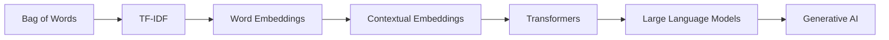

<div align="center">

# 💬 Natural Language Processing

### MS Artificial Intelligence • FAST-NUCES Islamabad


---

### 🤖 From Text Processing to Large Language Models

*"Teaching machines to understand, generate, and reason with human language."*

</div>

---

# 📖 Course Overview

This repository contains lecture notes, tutorials, laboratory exercises, assignments, and learning resources from the **Natural Language Processing (NLP)** course offered in the **MS Artificial Intelligence** program at **FAST-NUCES Islamabad**.

The course provides a comprehensive journey through modern NLP, beginning with traditional text processing techniques and progressing toward advanced topics including:

* Text Representation
* Vector Semantics
* Word Embeddings
* Transformers
* Large Language Models (LLMs)
* Fine-Tuning & Adaptation
* Emerging Trends in NLP

---

# 🎯 Learning Objectives

Upon completion of this course, students should be able to:

✅ Process and prepare textual data for machine learning

✅ Apply classical NLP feature engineering techniques

✅ Understand vector representations of language

✅ Build NLP pipelines using embeddings and transformers

✅ Analyze and fine-tune Large Language Models

✅ Explore state-of-the-art NLP research and applications

---

# 🗂 Course Roadmap

```text
Natural Language Processing
│
├── Foundations
│     ├── Introduction
│     ├── Applications
│     └── Datasets
│
├── Text Processing
│     ├── Tokenization
│     ├── Subword Models
│     └── BPE / WordPiece
│
├── Classical NLP
│     ├── Bag of Words
│     ├── TF-IDF
│     └── Text Classification
│
├── Semantic Representations
│     ├── Embeddings
│     └── Vector Semantics
│
├── Deep NLP
│     ├── Transformers
│     ├── LLMs
│     ├── Pretraining
│     └── Decoding
│
└── Advanced NLP
      ├── Fine-Tuning
      ├── Adaptation
      └── Future Trends
```

---

# 📚 Repository Contents

## 1️⃣ Foundations of NLP

| Resource                                         | Topics                           |
| ------------------------------------------------ | -------------------------------- |
| NLP 00 RoadMap                                   | Course Structure & Learning Path |
| NLP 01 Intro, Applications, Datasets, Challenges | NLP Fundamentals                 |

---

## 2️⃣ Text Preparation & Tokenization

| Resource                                   | Topics                        |
| ------------------------------------------ | ----------------------------- |
| NLP 02A Preparing Text for Language Models | Text Cleaning & Preprocessing |
| NLP 02B BPE Word Piece Tutorial            | Subword Tokenization          |
| NLP 02D Lab Text for Language Models       | Practical Exercises           |
| NLP BPE Activity                           | Hands-on BPE Implementation   |

---

## 3️⃣ Classical NLP

| Resource                                        | Topics                  |
| ----------------------------------------------- | ----------------------- |
| NLP 03 Classical Text Features & Classification | Traditional NLP Methods |
| NLP 03A TF-IDF Tutorial                         | Feature Engineering     |

---

## 4️⃣ Semantic Representations

| Resource                            | Topics                                   |
| ----------------------------------- | ---------------------------------------- |
| NLP 4 Vector Semantics & Embeddings | Word Embeddings & Meaning Representation |

---

## 5️⃣ Large Language Models

| Resource                             | Topics                       |
| ------------------------------------ | ---------------------------- |
| NLP 5 Large Language Models          | LLM Fundamentals             |
| NLP 6 LLM Decoding and Pretraining   | Training & Generation        |
| NLP 7 LLM Finetune                   | Task-Specific Adaptation     |
| NLP 8 LLM Adaptation & Future Trends | Emerging Research Directions |

---

## 6️⃣ Transformer Architectures

| Resource           | Topics                              |
| ------------------ | ----------------------------------- |
| DL 08 Transformers | Attention Mechanisms & Transformers |

---

# 🧠 Core Concepts Covered

### 📄 Text Processing

* Tokenization
* Normalization
* Stop Word Removal
* Stemming
* Lemmatization

### 📊 Feature Engineering

* Bag of Words
* N-Grams
* TF-IDF
* Statistical Text Features

### 🔤 Semantic Representations

* Distributional Semantics
* Word Embeddings
* Contextual Embeddings

### 🤖 Deep Learning for NLP

* Self-Attention
* Transformers
* Encoder-Decoder Models

### 🚀 Large Language Models

* Pretraining
* Fine-Tuning
* Prompt Engineering
* Adaptation Strategies
* Future Directions

---

# 📈 NLP Evolution



---

# 🛠 Technologies & Tools

<div align="center">

| Category         | Tools                     |
| ---------------- | ------------------------- |
| Programming      | Python                    |
| Data Processing  | Pandas, NumPy             |
| Machine Learning | Scikit-Learn              |
| Deep Learning    | TensorFlow, PyTorch       |
| NLP Libraries    | NLTK, SpaCy, Hugging Face |
| Development      | Jupyter Notebook, VS Code |

</div>

---

# 🔬 Applications of NLP

The concepts covered in this repository can be applied to:

* 💬 Chatbots & Virtual Assistants
* 🌐 Machine Translation
* 😊 Sentiment Analysis
* 📄 Document Classification
* 🔍 Information Retrieval
* 📰 Text Summarization
* 🧠 Question Answering Systems
* 🤖 Generative AI Applications

---

# 🎓 Academic Information

**Course:** Natural Language Processing

**Program:** MS Artificial Intelligence

**University:** FAST National University of Computer and Emerging Sciences (FAST-NUCES)

**Campus:** Islamabad

**Credit Hours:** 3

---

# 🚀 Learning Journey

```text
Raw Text
   ↓
Preprocessing
   ↓
Feature Engineering
   ↓
Embeddings
   ↓
Transformers
   ↓
Large Language Models
   ↓
Generative AI Systems
```

---

<div align="center">

### 💡 Language • Intelligence • Understanding • Generation

*"Natural Language Processing bridges the gap between human communication and machine intelligence."*

⭐ Exploring the evolution from classical NLP techniques to modern Large Language Models.

</div>
