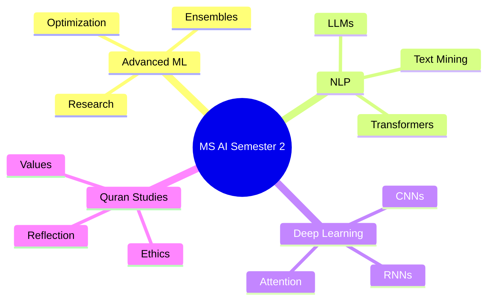

<div align="center">

# 🎓 MS Artificial Intelligence - FAST NUCES Islamabad
### 📚 Semester 2 Coursework Repository


---

*"Advancing knowledge in Artificial Intelligence through Machine Learning, Deep Learning, Natural Language Processing, and ethical understanding."*

</div>

---

# 📖 Overview

This repository contains coursework, assignments, projects, lecture notes, research material, and practical implementations completed during the **2nd Semester** of the **MS Artificial Intelligence** program at **FAST National University of Computer and Emerging Sciences (FAST-NUCES), Islamabad Campus**.

The semester focuses on advanced AI concepts, machine learning methodologies, deep learning architectures, natural language processing techniques, and the study of the Holy Quran.

---

# 🎯 Semester Statistics

| Category | Details |
|-----------|---------|
| 🎓 Program | MS Artificial Intelligence |
| 🏫 University | FAST-NUCES Islamabad |
| 📅 Semester | 2 |
| 📚 Courses | 5 |
| 🔢 Total Credit Hours | 11 |

---

# 📚 Courses

## 1️⃣ Advanced Machine Learning (Core)
**Credit Hours:** 3

Topics covered include:

- Advanced Supervised Learning
- Ensemble Methods
- Probabilistic Models
- Feature Engineering
- Model Evaluation & Optimization
- Research-Oriented ML Applications

📂 Folder: `Advanced_Machine_Learning/`

---

## 2️⃣ Natural Language Processing (Core)
**Credit Hours:** 3

Topics covered include:

- Text Processing
- Word Embeddings
- Language Models
- Transformer Architectures
- Information Retrieval
- NLP Applications

📂 Folder: `Natural_Language_Processing/`

---

## 3️⃣ Deep Learning (Mandatory Elective)
**Credit Hours:** 3

Topics covered include:

- Artificial Neural Networks
- CNNs
- RNNs & LSTMs
- Attention Mechanisms
- Transformers
- Deep Learning Frameworks

📂 Folder: `Deep_Learning/`

---

## 4️⃣ Understanding of the Holy Quran - I
**Credit Hours:** 1

Topics covered include:

- Quranic Themes
- Ethical Principles
- Social Values
- Reflection and Understanding

📂 Folder: `Understanding of the Holy Quran I/`

---

## 5️⃣ Understanding of the Holy Quran - II
**Credit Hours:** 1

Topics covered include:

- Advanced Quranic Studies
- Contemporary Applications
- Moral Development
- Islamic Worldview

📂 Folder: `Understanding of the Holy Quran - II/`

---

# 🗂 Repository Structure

```text
MS-AI-Semester-2/
│
├── Advanced_Machine_Learning/
│   ├── Tasks/Labs/
│
├── Natural_Language_Processing/
│   ├── Tasks/Labs/
│   ├── Multi-Modality/Projects
│
├── Deep_Learning/
│   ├── DL Tasks/Labs/
│   ├── Text Summarization/Projects
│
├── Holy_of_the_Holy_Quran_I/
│   └── README.md
│
├── Holy_of_the_Holy_Quran_II/
└── README.md
```

---

# 🚀 Learning Objectives

✔ Develop expertise in modern Machine Learning techniques

✔ Understand state-of-the-art Deep Learning architectures

✔ Build practical Natural Language Processing systems

✔ Conduct AI-focused research and experimentation

✔ Strengthen ethical and moral understanding through Quranic studies

---

# 🛠 Technologies & Tools

<p align="center">


</p>

---

# 📈 Academic Focus Areas



---

# 🎯 Credit Hour Distribution

| Course | Credits |
|----------|---------|
| Advanced Machine Learning | 3 |
| Natural Language Processing | 3 |
| Deep Learning | 3 |
| Understanding of the Holy Quran I | 1 |
| Understanding of the Holy Quran II | 1 |
| **Total** | **11** |

---

# 📌 Repository Purpose

This repository serves as:

- A centralized archive of semester coursework.
- A reference for future research and projects.
- A portfolio of academic progress in AI.
- A knowledge base for advanced AI concepts.

---

# 👨‍🎓 Student Information

**MS Artificial Intelligence**  
**FAST-NUCES Islamabad**  
**Semester 2**

---

<div align="center">

### 🌟 Artificial Intelligence • Research • Innovation • Learning 🌟

**FAST National University of Computer and Emerging Sciences (FAST-NUCES)**

</div>
