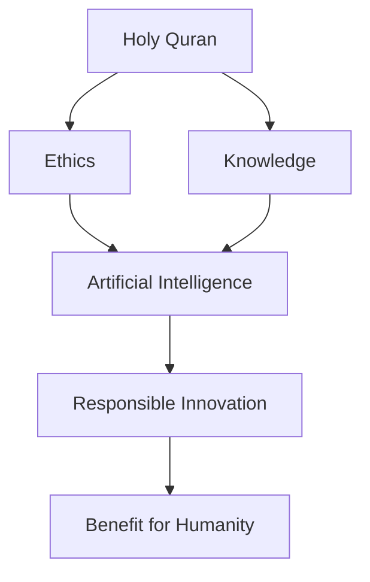

<div align="center">

# 📖 Understanding of the Holy Quran I & II

### MS Artificial Intelligence • FAST-NUCES Islamabad


---

### 🌙 Exploring Quranic Knowledge, Islamic Thought, Ethics, Shariah, Ijtihad, and Their Relevance to Artificial Intelligence

*"Indeed, in the creation of the heavens and the earth are signs for people of understanding."*
**— Quran 3:190**

</div>

---

# 📚 About This Repository

This repository contains coursework, presentations, research explorations, and academic resources studied during **Understanding of the Holy Quran I & II** as part of the **MS Artificial Intelligence** program at **FAST National University of Computer and Emerging Sciences (FAST-NUCES), Islamabad**.

The collection explores:

* 📖 Quranic Studies
* ⚖️ Objectives of Shariah (Maqasid al-Shariah)
* 🕌 Islamic Jurisprudence (Fiqh)
* 💡 Ijtihad and Contemporary Challenges
* 🤖 Artificial Intelligence & Islamic Ethics
* 📊 Islamic Economic Systems
* 📚 Principles of Quranic Interpretation (Tafsir)

---

# 🎯 Course Learning Outcomes

Through these courses, students develop:

* A foundational understanding of the Holy Quran
* Knowledge of Quranic themes and guidance
* Familiarity with Islamic legal reasoning
* Understanding of Maqasid al-Shariah
* Ability to analyze modern technological developments from an Islamic perspective
* Critical thinking regarding AI, ethics, and religion

---

# 📂 Repository Contents

## 📖 Core Study Resources

| Resource                                    | Description                          |
| ------------------------------------------- | ------------------------------------ |
| 📘 Al-Fauz Al-Kabir (English)               | Principles of Quranic Interpretation |
| 📗 الفوز الكبير في أصول التفسير (Urdu)      | Urdu Translation of Al-Fauz Al-Kabir |
| ⚖️ Classification of Islamic Rules          | Derivation from Quran & Sunnah       |
| 🎯 Objectives of Shariah According to Quran | Maqasid al-Shariah                   |
| 💰 Islamic Economic System                  | Foundations of Islamic Economics     |

---

## 🤖 AI & Islamic Thought

| Resource                                                                 | Focus Area                           |
| ------------------------------------------------------------------------ | ------------------------------------ |
| AI_Ijtihad_Presentation                                                  | AI and Contemporary Ijtihad          |
| QuranAI Research Project                                                 | Artificial Intelligence Applications |
| QuranAI Voice Presentation                                               | Voice-Based Quranic AI Systems       |
| Exploring Parallels Between Islamic Theology and Technological Metaphors | Interdisciplinary Research           |

---

# 🧠 Major Themes Explored

```text
Holy Quran
│
├── Tafsir & Interpretation
├── Shariah Objectives
├── Islamic Jurisprudence
├── Ethical Decision Making
├── Contemporary Ijtihad
│
└── Artificial Intelligence
      ├── AI Ethics
      ├── Human-Centered AI
      ├── Responsible Innovation
      └── Faith & Technology
```

---

# 🔍 Research Areas

This repository particularly focuses on the intersection of:

### 📖 Islamic Studies

* Quranic Interpretation
* Fiqh
* Usul al-Tafsir
* Maqasid al-Shariah

### 🤖 Artificial Intelligence

* AI Ethics
* Responsible AI
* Explainable AI
* Human-Centered Computing

### 🌍 Interdisciplinary Research

* Technology and Religion
* AI Governance
* Digital Ethics
* Contemporary Islamic Thought

---

# 📊 Repository Structure

```text
Quran-I-II/
│
├── AI_Ijtihad_Presentation.pptx
├── QuranAI_25i-7601.pdf
├── QuranAI_Voice_Presentation_Final.pptx
│
├── Al-Fauz-Al-Kabir-English.pdf
├── الفوز-الكبير-في-اصول-التفسير-اردو.pdf
│
├── Classification-of-Islamic-Rules.pdf
├── Objectives-of-Shariah.pdf
├── Islamic-Economic-System.pdf
│
├── Exploring-Parallels-Between-Islamic-Theology-and-Technological-Metaphors.pdf
│
└── README.md
```

---

# 🌟 Key Insights

### Ethics Before Technology

The study of the Quran emphasizes that knowledge must be accompanied by wisdom, responsibility, and ethical conduct.

### Ijtihad in the Digital Age

Modern technologies such as Artificial Intelligence create new questions that require informed scholarly reasoning and contemporary Ijtihad.

### Human-Centered Innovation

Islamic principles encourage innovation that benefits humanity while preserving justice, dignity, and accountability.

---

# 🚀 Relevance to Artificial Intelligence

The emergence of advanced AI systems raises important questions regarding:

* Ethical decision-making
* Bias and fairness
* Accountability
* Human autonomy
* Social responsibility

Many of these concerns align closely with principles discussed within Islamic ethics and the objectives of Shariah, making interdisciplinary study increasingly valuable.

---

# 📈 Academic Reflection

This repository represents an effort to connect:



---

# 🎓 Academic Information

**Program:** MS Artificial Intelligence

**University:** FAST National University of Computer and Emerging Sciences (FAST-NUCES)

**Campus:** Islamabad

**Course Credits:** 2 Credit Hours

* Understanding of the Holy Quran I (1 CH)
* Understanding of the Holy Quran II (1 CH)

---

<div align="center">

### 🌙 Knowledge • Reflection • Ethics • Innovation

*"And say: My Lord, increase me in knowledge."*
**(Quran 20:114)**

</div>

